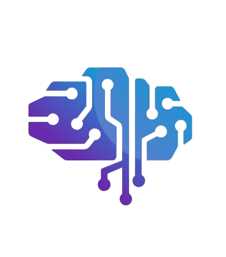

<p align="center">
  
</p>

<h1 align="center">ReMIND™</h1>

<p align="center">
  Intelligent Memory Reconstruction Platform
</p>

<p align="center">
  Final Year Project • University of Central Punjab (UCP), Lahore
</p>

<p align="center">
  Developed by Muhammad Hassan Ashraf, Muhammad Talha Faizan, and Mubashar Tanveer
</p>

---

<p align="center">


</p>

---

## Overview

ReMIND™ is an intelligent memory reconstruction platform developed as a Final Year Project at the University of Central Punjab (UCP), Lahore.

The project explores how modern computing technologies can assist individuals experiencing memory-related difficulties by reconstructing fragmented information from text, voice, and image inputs. Rather than functioning as a traditional reminder application, ReMIND focuses on rebuilding context around memories and presenting information in a meaningful and accessible manner.

The platform integrates multiple specialized processing modules into a unified web application, enabling users to interact with memories through conversational interfaces, multimedia content, and intelligent reconstruction services.

ReMIND was developed with the belief that technology should be used to improve quality of life and support human well-being through practical innovation.

---

## Problem Statement

Memory-related conditions such as Alzheimer's Disease and Dementia affect millions of individuals worldwide and often lead to progressive cognitive decline, loss of contextual understanding, and difficulty recalling important life events.

Existing digital solutions typically focus on reminders, calendars, or note-taking systems. While these tools assist with organization, they generally do not address the challenge of reconstructing fragmented memories or restoring context surrounding past experiences.

ReMIND explores an alternative approach by combining multiple computational techniques to assist users in rebuilding contextual information from various forms of input, including conversations, images, and voice recordings.

---

## Vision

To explore the future of technology-assisted memory support systems and contribute toward the development of accessible tools that can help individuals preserve, understand, and reconnect with their personal experiences.

---

## Objectives

- Develop a unified platform for memory reconstruction.
- Integrate text, voice, and image processing capabilities within a single application.
- Provide an intuitive and accessible user experience.
- Explore practical applications of intelligent information processing in healthcare-related domains.
- Demonstrate the potential of multimodal systems in supporting memory assistance workflows.
- Establish a foundation for future research and development in memory reconstruction technologies.

---

## Impact

ReMIND was created with the belief that technology can play a meaningful role in addressing real-world challenges that affect individuals, families, and communities.

The project aims to contribute to ongoing discussions surrounding cognitive healthcare, memory assistance technologies, human-computer interaction, and accessible digital support systems. While the current implementation serves as a proof-of-concept, the underlying ideas have potential applications in healthcare, assisted living environments, memory preservation systems, and future digital therapeutic platforms.

The ReMIND team hopes that researchers, developers, healthcare professionals, and innovators continue exploring this area and expand upon these concepts to create solutions that positively impact society and improve quality of life.

---

# Key Features

## Memory Reconstruction

- Context-aware memory rebuilding
- Conversational memory interaction
- Multi-source information processing
- Intelligent memory retrieval

## Text Processing

- Intent classification
- Entity extraction
- Context generation
- Retrieval-Augmented Generation (RAG)
- Memory reconstruction workflows

## Voice Processing

- Speech-to-text conversion
- Audio preprocessing
- Emotion detection
- Tone analysis
- Voice synthesis

## Image Processing

- Image enhancement
- Face restoration
- Automated image captioning
- Visual context extraction

## Authentication & Security

- JWT Authentication
- Google OAuth Integration
- Role-Based Access Control
- Protected Routes
- Session Management

## Administration

- User Management
- Memory Management
- Analytics Monitoring
- Audit Logging
- System Activity Tracking

---

# Technology Stack

## Frontend

- React.js
- React Router
- Axios
- Context API
- CSS3

## Backend

- FastAPI
- SQLAlchemy
- Alembic
- JWT Authentication
- OAuth2

## Database

- PostgreSQL

## Text Processing

- Groq API
- LLaMA 3
- FAISS
- Sentence Transformers

## Voice Processing

- Whisper
- ElevenLabs
- Google Text-to-Speech

## Image Processing

- Real-ESRGAN
- GFPGAN
- ViT-GPT2

## Storage

- Cloudinary

---

# Repository Structure

```text
ReMIND/
│
├── backend_final/
│
├── frontend/
│
├── image_ai/
│
├── text_ai/
│
├── voice_ai/
│
├── docs/
│
├── visuals/
│
├── README.md
├── requirements.txt
└── .gitignore
```

---

# Core Modules

## Backend

Responsible for:

- API Services
- Authentication
- Database Operations
- Memory Processing
- User Management
- Administration Services
- AI Integration & Orchestration

---

## Frontend

Responsible for:

- User Interface
- Authentication Flows
- Dashboard Management
- Chat Experience
- Administrative Interface
- Responsive Design

---

## Text Processing Module

Responsible for:

- Natural Language Processing
- Context Generation
- Retrieval-Augmented Generation
- Memory Reconstruction
- Response Evaluation

---

## Voice Processing Module

Responsible for:

- Audio Preprocessing
- Speech Recognition
- Emotion Detection
- Tone Classification
- Speech Synthesis

---

## Image Processing Module

Responsible for:

- Image Enhancement
- Face Restoration
- Caption Generation
- Visual Context Analysis
- Quality Evaluation

---

# Installation

## Clone Repository

```bash
git clone https://github.com/your-organization/ReMIND.git

cd ReMIND
```

---

## Backend Setup

```bash
cd backend_final

python -m venv venv
```

Activate environment:

Linux/macOS:

```bash
source venv/bin/activate
```

Windows:

```bash
venv\Scripts\activate
```

Install dependencies:

```bash
pip install -r requirements.txt
```

Apply database migrations:

```bash
alembic upgrade head
```

Run backend server:

```bash
uvicorn app.main:app --reload
```

---

## Frontend Setup

```bash
cd frontend

npm install

npm start
```

---

# Project Status

**Development Status:** Completed

**Testing Status:** Completed

**Deployment Status:** Completed

**Current Stage:** Proof-of-Concept (Final Year Project)

**Future Direction:** Production-Grade Memory Assistance Platform

---

# Future Development Roadmap

The current implementation serves as a proof-of-concept demonstrating the feasibility of intelligent memory reconstruction systems.

Potential future developments include:

- Clinical validation and user studies
- Production-grade infrastructure
- Mobile applications
- Enhanced accessibility support
- Multilingual capabilities
- Advanced memory visualization systems
- Healthcare provider integration
- Scalable cloud-native architecture
- Personalized memory recommendation systems
- Long-term digital memory preservation services

---

# Academic Information

### Institution

**University of Central Punjab (UCP)**
Lahore, Punjab, Pakistan

---

### Project Advisor

**Muhammad Zulkifl Hassan**
Principal Lecturer
Faculty of Information Technology
University of Central Punjab (UCP)

Email: [zulkifl.hassan@ucp.edu.pk](mailto:zulkifl.hassan@ucp.edu.pk)

---

# Development Team

## Muhammad Hassan Ashraf

**Responsibilities**

- Project Lead
- End-to-End Project Management
- Project Planning & Coordination
- Voice Processing Development
- Backend Integration
- System Integration

LinkedIn:
https://www.linkedin.com/in/muhammad-hassan-a-0389a4363/

---

## Muhammad Talha Faizan

**Responsibilities**

- Image Processing Development
- Frontend Development
- User Interface Design
- User Experience Implementation

LinkedIn:
https://www.linkedin.com/in/m-talha-faizan-46158532a/

---

## Mubashar Tanveer

**Responsibilities**

- Text Processing Development
- Retrieval-Augmented Generation (RAG)
- Prompt Engineering
- Backend API Development

LinkedIn:
https://www.linkedin.com/in/mubashar-tanveer-0441652a9/

---

# Administration & Contact

System Administration and maintenance are managed by the ReMIND Team.

**Contact Email:**
[xremind.3@gmail.com](mailto:xremind.3@gmail.com)

---

# Trademark Notice

ReMIND™ is a project name and identity developed by the ReMIND Team.

All associated branding, visual identity, documentation, project materials, and related intellectual property remain the property of their respective owners unless otherwise stated.

---

# License

Licensed under the Apache License, Version 2.0.

Copyright © 2026 ReMIND Team

Licensed under the Apache License, Version 2.0 (the "License"); you may not use this project except in compliance with the License.

You may obtain a copy of the License at:

http://www.apache.org/licenses/LICENSE-2.0

Unless required by applicable law or agreed to in writing, software distributed under the License is distributed on an "AS IS" BASIS, WITHOUT WARRANTIES OR CONDITIONS OF ANY KIND, either express or implied.

See the LICENSE file for the specific language governing permissions and limitations under the License.
